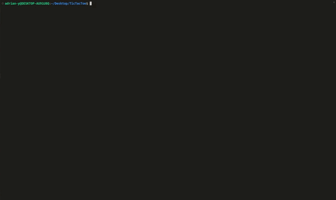

# TicTacToe Game (CLI)

**To play the game visit [replit](https://replit.com/@adrian-y1/TicTacToe) and run `ruby lib/game.rb` inside the terminal.**

This is a two-player command-line interface TicTacToe game created with the Ruby language. This project was part of [The Odin Project's Ruby course.](https://www.theodinproject.com/lessons/ruby-tic-tac-toe)

 
*A quick GIF demonstration of a diagonal TicTacToe win*

## Overview
This Tic Tac Toe game implemented as a Ruby CLI allows two players to compete against each other by taking turns inputting their game pieces (X & O) into numbered squares displayed on the board. The objective is to have three of one's own pieces in a horizontal, vertical, or diagonal line while preventing the opponent from achieving the same.

In this game, players enter commands in the CLI to specify the square they want to input their piece in. The implementation includes several features, including detecting valid moves/inputs, identifying a win or draw, and displaying the current game board after each turn.

To ensure the game runs smoothly and correctly, Rspec 3.11 has been used to create tests that focus on critical class methods. 

## How To Play
- Online
  - To play online visit the link at the top of this document or click [here](https://replit.com/@adrian-y1/TicTacToe)
  - Press `Run` and then enter `ruby lib/game.rb` inside the teminal to begin the game.
- Local
  - To play locally, you must first install [Ruby](https://www.ruby-lang.org/en/)
  - After that, [clone](https://github.com/git-guides/git-clone) this [repository](https://github.com/adrian-y1/TOPTicTacToe)
  - To start the game, enter `ruby lib/game.rb` in the terminal
  - To run the tests you must first install [Rspec](https://rspec.info/)
  - After that, enter `rspec spec/` to execute all the tests
    - Alternatively you can enter `rspec spec/path/to/file` to execute tests for a specific file or folder

## Features
- Two-player game
- Interactive gameplay through command-line interface
- Vertical, horizontal, and diagonal win conditions
- Error handling for invalid inputs or moves
- Display of the game board after each turn
- Class method tests using `Rspec`

## Difficulties 
Developing this TicTacToe game presented a significant challenge, as it was the first sizeable Ruby project I tackled that required handling complex logic. After receiving feedback, I realized that I had not followed the principles of object-oriented programming (OOP) and therefore had to rebuild the entire game with OOP in mind. One of the most difficult parts was understanding the necessary logic for checking wins on the game board.

Testing the my second implementation with Rspec posed another significant challenge, as it was my first time doing so. I encountered numerous issues, including problems with dependency injections because my code relied on test doubles. It took me some time to fully comprehend the use of test doubles and how they worked in practice.

## Overcoming Difficulties
After receiving feedback on my initial TicTacToe implementation from the [Ruby discord community](https://discord.gg/ruby-518658712081268738), I realized that it did not follow OOP principles. To gain a better understanding of OOP, I sought help from community members who explained in detail the things I had done and what I could do to improve my code. I also did additional reading and watched videos on OOP with Ruby to further enhance my understanding.

To tackle the difficulties in checking for TicTacToe win conditions, I carefully planned and drew out the different scenarios on paper to better visualize and understand them. This helped me come up with a more structured approach to solving the problem.

When it came to testing the application, I faced several challenges, including understanding dependency injections and using test doubles. To overcome these issues, I sought assistance from [The Odin Project's discord](https://discord.gg/V75WSQG) and also read articles and watched videos on testing with RSpec and test doubles. With the gained knowledge, I was able to refactor my code to use dependency injections, making it much easier to test the application.

## Conclusion
Overall, developing this TicTacToe CLI game using Ruby was a great learning experience for me. It allowed me to practice my problem-solving skills and gave me a better understanding of Object-Oriented Programming principles. The challenges I faced with the logic handling and testing were daunting at first, but with the help of the Ruby and The Odin Project communities, as well as some additional research, I was able to overcome them and create a functional game that follows good programming practices.

I have been able to apply what I learned from this project to other programming projects, such as [Connect Four](https://github.com/adrian-y1/TOPConnectFour) and [Chess](https://github.com/adrian-y1/TOPChess), particularly in terms of proper code structuring and testing.